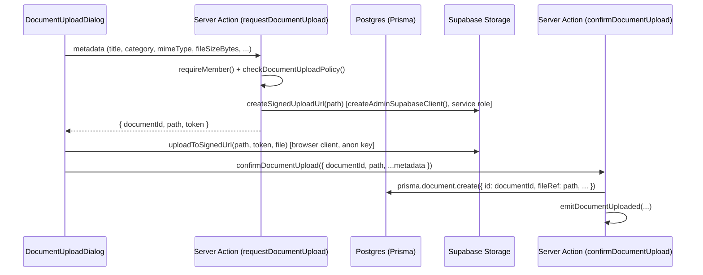

# File Uploads & Supabase Storage

How Home OS stores and serves the binary side of the **Document** entity
(`plan.md` §3.5) — the reusable file/attachment capability every module
(Life Admin's own Renewals/Contacts, Finance's Transaction receipts, and any
future module per `AGENTS.md` §2 Step 0's reuse table) builds on instead of
inventing its own upload path.

**Scope of this doc:** the Supabase Storage side of `Document` — bucket
layout, the upload flow, the locked file-type/size policy, preview/download
rendering, and how storage access is gated by the exact same
`visibility`/`ObjectShare` rule as the `Document` database row. It does not
redefine `Document`'s CRUD/sharing conventions from scratch; those follow
`docs/resources.md`'s entity-registration pattern like every other Life Admin
entity — this doc only owns the parts specific to *storing and serving
bytes*, which no other doc covers yet.

> **Companion docs, not duplicated here:**
> [`docs/access-control.md`](./access-control.md) owns the
> `private | household | specific_members` contract and the
> `visibilityWhere()` query-scoping algorithm this doc reuses verbatim for
> storage access — read that first if the visibility contract itself is
> unfamiliar. [`docs/orm-conventions.md`](./orm-conventions.md) §5 already
> establishes that `Document.fileRef` is "a plain string path/key into a
> Storage bucket, not a Prisma-modeled relation" — this doc is where that
> string's exact shape and lifecycle are defined.
> [`docs/project-structure.md`](./project-structure.md) owns where the code
> below lives (`src/lib/`, `src/modules/life-admin/`).
> [`docs/resources.md`](./resources.md) owns the generic
> entities/queries/actions/events/components shape a new entity follows;
> this doc's code samples follow that shape for `Document` specifically,
> using the real, shipped helper names per `docs/resources.md` §0:
> `requireMember()` (`@/lib/auth/session`, returns `ActingMember | null` —
> never destructures into `{ member, household }`), `visibilityWhere()`
> (`@/lib/access/visibility`), and `hasAtLeastRole()`
> (`@/lib/access/roles`) rather than a `requireRole()` helper, which doesn't
> exist.
>
> **Not yet listed in `CLAUDE.md`'s doc index** (it predates this file) —
> add a row for `docs/upload.md` next time that table is touched, the same
> gap `docs/resources.md` §0 already flagged for `docs/access-control.md`.

---

## 1. What this covers, and what it deliberately doesn't

In scope: everything needed to take `Document` from "a Prisma row with a
`fileRef` string" to "a member can actually upload a receipt photo, see it
listed, preview it, and delete it — safely, for the household they belong
to, and only if their `visibility` permits it."

Out of scope, on purpose, matching `plan.md`'s V1 boundary:

- **`DocumentVersion` (V2, out of scope).** Re-uploading a `Document`
  overwrites the stored file in place — no version history. §5.5 covers the
  "replace" flow this implies.
- **Virus/content scanning, OCR, thumbnail generation pipelines.** V1 trusts
  the household's own members with what they upload (same trust model as
  everything else in a single-tenant household) and renders previews
  directly from the original file — no derived-asset pipeline.
- **Any Document-specific role/permission model.** Document uses the exact
  same `visibility`/`ObjectShare` contract, the same tenant scoping, and the
  same "no special stricter rule" philosophy `plan.md` §9 Q22 states
  explicitly for Finance — there's no reason Documents (which *include*
  Finance receipts, per `Transaction.attachment`) would be held to a
  different standard.

---

## 2. The `Document` Prisma model (recap)

`Document` lives in the `life_admin` banner section of the single
`prisma/schema.prisma` (`docs/orm-conventions.md` §1.1), right alongside
`Renewal`/`Contact`/`ShoppingList`. This doc doesn't re-derive it from
scratch — it's already fully specified by `plan.md` §3.5 plus
`docs/orm-conventions.md`'s naming rules — but it's reproduced here in full
because everything else in this doc (the object-path builder, the visibility
scope constant, every query/action) is written against these exact fields:

```prisma
// prisma/schema.prisma — inside the existing "Module: life_admin" section

enum DocumentCategory {
  warranty_proof
  insurance_policy
  id_document
  receipt
  manual_guide
  contract
  property_record
  other
}

// plan.md §3.5 also lists a literal `none` value alongside these six. Since
// the field itself is optional, `null` already means "not linked to
// anything" — this schema treats `null` as that case and does not add a
// redundant `none` enum value. Flag this if plan.md is ever amended to make
// `none` load-bearing for something `null` can't express.
enum DocumentLinkedEntityType {
  renewal
  contact
  subscription
  task
  note
  event
}

model Document {
  id            String    @id @default(cuid())
  householdId   String
  household     Household @relation(fields: [householdId], references: [id])

  title         String
  // Storage object path/key — see §3 below. Plain string, no @relation:
  // Storage objects aren't Postgres rows Prisma can model (docs/orm-conventions.md §5).
  fileRef       String
  mimeType      String?
  fileSizeBytes Int?

  category      DocumentCategory @default(other)
  description   String?

  // Generic polymorphic target — plain scalars, no @relation, per
  // docs/orm-conventions.md §4. Both set together or neither, enforced in
  // entities/document.ts (§9 below), not at the DB level.
  linkedEntityType DocumentLinkedEntityType?
  linkedEntityId   String?

  // docs/orm-conventions.md §2.3: plan.md spells this field bare
  // ("uploadedBy"), so the relation object keeps that name and the scalar
  // column gets "Id" appended — this is that rule's own worked example.
  uploadedBy    Member    @relation(fields: [uploadedById], references: [id])
  uploadedById  String

  visibility    Visibility @default(household)

  createdAt     DateTime  @default(now())
  updatedAt     DateTime  @updatedAt

  @@index([householdId])
  @@index([householdId, linkedEntityType, linkedEntityId])
}
```

```bash
pnpm prisma format && pnpm prisma validate
pnpm prisma migrate dev --name add_document
```

The visibility-scope constant every query/action below imports:

```ts
// src/modules/life-admin/entities/document.ts (excerpt — full file in §9)
export const DOCUMENT_VISIBILITY_SCOPE = {
  moduleKey: "life_admin",
  objectType: "Document",
  ownerField: "uploadedById", // the scalar column — see the schema comment above
} as const;
```

---

## 3. Supabase Storage bucket structure

### 3.1 One bucket, household-scoped by object path — not one bucket per household

`ROADMAP.md`'s Phase 0 checklist provisions exactly **one** Supabase Storage
bucket for both `Document.fileRef` (Life Admin) and `Transaction.attachment`
(Finance, which reuses `Document` rather than building its own file store —
§8). Call it `documents`. A bucket per household would need a Supabase
Management-API call on every household signup and doesn't buy anything a
path prefix doesn't already give us — Postgres is where tenant isolation is
actually enforced (`docs/orm-conventions.md` §3), and Storage just needs a
layout that makes a household's objects trivially group-able and never
guessable across households.

Every object's key follows one fixed shape:

```
households/<householdId>/documents/<documentId>/<uploadToken>-<sanitizedFileName>
```

```ts
// src/lib/storage/paths.ts
import { randomUUID } from "node:crypto";

/**
 * Builds the Storage object key for one upload attempt. The `uploadToken`
 * segment (a fresh UUID per call) is what makes re-uploading/replacing a
 * Document's file safe (§5.5) — the new object never collides with the one
 * it's about to replace, so the old file can be deleted only *after* the
 * new one is confirmed on disk, never before.
 */
export function buildDocumentObjectPath(householdId: string, documentId: string, fileName: string): string {
  return `households/${householdId}/documents/${documentId}/${randomUUID()}-${sanitizeFileName(fileName)}`;
}

function sanitizeFileName(fileName: string): string {
  return fileName.replace(/[^a-zA-Z0-9._-]/g, "_").slice(-140);
}
```

The `<householdId>/<documentId>` prefix means every object belonging to one
household's one `Document` row sits under one predictable folder — useful
for the (rare, V1-manual) case of inspecting storage contents directly in
the Supabase dashboard, and it's what §7's delete flow globs against if a
`Document` ever needs its whole folder cleared.

### 3.2 The bucket is private — no public URLs, ever

The bucket is created with `public: false`. There is no code path anywhere
in Home OS that requests a permanent/public Supabase Storage URL for a
`Document` — every read goes through a **signed URL**, freshly minted, only
after the visibility check in §6 passes. This is deliberate: `Document`
stores warranty proofs, insurance policies, and **ID documents**
(`DocumentCategory.id_document`) — the most sensitive category in the whole
plan — so "private bucket + short-lived signed URLs, minted server-side
after an app-layer check" is the only acceptable default, not an
optimization.

### 3.3 Bucket-level file-type/size limits — the same "primary check + automated backstop" shape as tenant scoping

`docs/orm-conventions.md` §3.2 enforces `householdId` scoping with an
explicit app-layer check *plus* a Prisma extension that throws if that check
is ever missing — a manual primary mechanism backed by an automated
backstop that catches what review misses. The upload policy (§4) uses the
identical shape: the **primary** check is the `zod`/application-layer
validation in every Server Action below; the **backstop** is Supabase
Storage's own bucket-level `fileSizeLimit`/`allowedMimeTypes`, configured
once when the bucket is created, which rejects the *actual bytes* at the
storage layer regardless of what a (possibly tampered) client claims in its
request metadata:

```ts
// scripts/setup-storage-bucket.ts — run once per environment (local, staging, prod),
// same "provision once, not per household" tier as prisma/seed.ts's platform-catalog rows.
// Invoked via `pnpm run storage:setup` (tsx scripts/setup-storage-bucket.ts).
//
// Deliberately does NOT import "@/lib/supabase/admin" — that file (and
// anything importing "server-only") resolves fine inside Next.js's bundler
// (which special-cases the bare "server-only"/"client-only" specifiers) but
// genuinely doesn't exist as an installed package, so `tsx` (and Vitest,
// running outside Next's bundler entirely) throws "Cannot find module
// 'server-only'" the moment it reaches one — confirmed empirically, not a
// theoretical concern (docs/toolkit.md §1 has the same gotcha, and it bit
// this exact script during Life Admin's build). This script constructs its
// own few-line admin client instead of reaching into app code that carries
// the tag; `prisma/seed.ts` sidesteps the same landmine by only importing
// `src/lib/db.ts`, which has no "server-only" anywhere in its own chain.
import { createClient } from "@supabase/supabase-js";
import { DOCUMENTS_BUCKET, MAX_DOCUMENT_FILE_SIZE_BYTES, ALLOWED_DOCUMENT_MIME_TYPES } from "../src/lib/storage/policy";

async function main() {
  const supabase = createClient(process.env.NEXT_PUBLIC_SUPABASE_URL!, process.env.SUPABASE_SERVICE_ROLE_KEY!, {
    auth: { autoRefreshToken: false, persistSession: false },
  });

  const { error } = await supabase.storage.createBucket(DOCUMENTS_BUCKET, {
    public: false,
    fileSizeLimit: MAX_DOCUMENT_FILE_SIZE_BYTES, // bytes — see §4.1
    allowedMimeTypes: [...ALLOWED_DOCUMENT_MIME_TYPES],
  });
  // "already exists" is fine on re-run — this script is idempotent, not one-shot-only.
  if (error && error.message !== "The resource already exists") throw error;
}

main().catch((error) => {
  console.error(error);
  process.exit(1);
});
```

Equivalent dashboard steps (Supabase → Storage → New bucket → `documents`,
uncheck "Public bucket", then Storage → `documents` → Configuration → set
the same file-size limit and MIME allow-list) work identically; the script
just makes the configuration reviewable/repeatable across environments
instead of a one-off dashboard click nobody remembers making.

---

## 4. The locked file-type/size policy

`plan.md` §9 Q27: *"fixed platform-wide limit (e.g. PDF/images, 10MB — exact
allow-list/limit to be finalized during implementation)."* This is that
finalization — not household-configurable, not overridable per record.

### 4.1 The constants

```ts
// src/lib/storage/policy.ts — no "server-only" here: these constants are
// also imported client-side (§5) for the pre-upload UX check in §4.2.
export const DOCUMENTS_BUCKET = "documents" as const;

export const MAX_DOCUMENT_FILE_SIZE_BYTES = 10 * 1024 * 1024; // 10MB, plan.md §9 Q27

export const ALLOWED_DOCUMENT_MIME_TYPES = [
  "application/pdf",
  "image/jpeg",
  "image/png",
  "image/webp",
  "image/heic", // phone camera photos of a receipt/warranty label, iOS default format
] as const;
export type AllowedDocumentMimeType = (typeof ALLOWED_DOCUMENT_MIME_TYPES)[number];

export type DocumentPolicyResult = { ok: true } | { ok: false; reason: string };

export function checkDocumentUploadPolicy(input: { mimeType: string; fileSizeBytes: number }): DocumentPolicyResult {
  if (!ALLOWED_DOCUMENT_MIME_TYPES.includes(input.mimeType as AllowedDocumentMimeType)) {
    return { ok: false, reason: "Only PDF or image files (JPEG, PNG, WebP, HEIC) are accepted." };
  }
  if (input.fileSizeBytes > MAX_DOCUMENT_FILE_SIZE_BYTES) {
    return { ok: false, reason: "Files must be 10MB or smaller." };
  }
  return { ok: true };
}
```

### 4.2 Three enforcement points, only one of which actually matters for security

1. **Client-side, before the file picker even submits** — a UX nicety only
   (matches `docs/access-control.md` §1's "no client-side-only checks" — the
   Server Action re-checks unconditionally, the same non-goal restated for
   uploads). Import the same constants into the form component so the error
   message a member sees ("Files must be 10MB or smaller") appears instantly
   instead of after a round trip.
2. **`checkDocumentUploadPolicy()` inside the Server Action** (§5.2, §5.5) —
   the real gate. Called against the declared `mimeType`/`fileSizeBytes`
   before a signed upload URL is ever minted; a rejected file never gets as
   far as touching Storage.
3. **The bucket's own `fileSizeLimit`/`allowedMimeTypes`** (§3.3) — the
   backstop. A client could in principle lie about a file's declared
   `mimeType`/size to a Server Action, but the *actual bytes* PUT to the
   signed URL still have to satisfy the bucket's own constraint, enforced by
   Supabase Storage itself, independent of anything our application code
   claimed.

---

## 5. The upload flow

### 5.1 Why a signed upload URL, not proxying the file through a Server Action

Every other mutation in Home OS is a plain Server Action (`docs/project-structure.md`
§7: "Server Actions are the default for every mutation our own UI
triggers"). Uploading a `Document`'s bytes is the one deliberate exception,
for a concrete platform reason: Home OS is hosted on Vercel (locked stack
decision), and Vercel's serverless functions — which is what a Next.js
Server Action compiles to — cap request body size well under the 10MB limit
this policy allows. Proxying the raw file through a Server Action would
silently fail (or silently re-cap the real limit far below what §4 promises)
the moment someone actually uploads a file near the stated maximum.

The fix is to never send the file bytes to *our* server at all. A Server
Action mints a **signed upload URL** scoped to one exact object path and a
short expiry; the browser then PUTs the file bytes **directly to Supabase
Storage**, bypassing our serverless function's body-size limit entirely.
Only small JSON (metadata, the signed token) ever passes through a Server
Action.

This is a two-step **request → confirm** shape, used identically for a
brand-new upload (§5.2–§5.4) and for replacing an existing file in place
(§5.5):



### 5.2 `requestDocumentUpload` — validate, mint the signed URL, don't touch Postgres yet

```ts
// src/modules/life-admin/actions/request-document-upload.ts
"use server";

import { randomUUID } from "node:crypto";
import { requireMember } from "@/lib/auth/session";
import { createAdminSupabaseClient } from "@/lib/supabase/admin";
import { checkDocumentUploadPolicy, DOCUMENTS_BUCKET } from "@/lib/storage/policy";
import { buildDocumentObjectPath } from "@/lib/storage/paths";

export async function requestDocumentUpload(input: { fileName: string; mimeType: string; fileSizeBytes: number }) {
  const member = await requireMember();
  if (!member) throw new Error("Not authenticated");

  const policy = checkDocumentUploadPolicy(input);
  if (!policy.ok) throw new Error(policy.reason); // plain Error — there's no ValidationError class in this codebase

  // Pre-generate the id: Document.id is @default(cuid()) in the schema, but
  // we need a stable id *before* the row exists, to build the object path
  // it's uploaded into. Prisma accepts any unique string as an explicit
  // `id` at create time (§5.4) — it only auto-generates one when omitted.
  const documentId = randomUUID();
  const path = buildDocumentObjectPath(member.householdId, documentId, input.fileName);

  // createAdminSupabaseClient() is a factory (@/lib/supabase/admin) — called
  // fresh per use, the same way src/app/(auth)/actions.ts and
  // settings/members/actions.ts already call it, not a pre-built
  // `supabaseAdmin` singleton export.
  const supabase = createAdminSupabaseClient();
  const { data, error } = await supabase.storage.from(DOCUMENTS_BUCKET).createSignedUploadUrl(path);
  if (error || !data) throw new Error(`Could not prepare upload: ${error?.message ?? "unknown error"}`);

  return { documentId, path, token: data.token };
}
```

### 5.3 The browser PUTs the bytes directly to Storage

```ts
// src/modules/life-admin/components/document-upload-dialog.tsx (excerpt)
"use client";
import { createBrowserSupabaseClient } from "@/lib/supabase/client";
import { DOCUMENTS_BUCKET } from "@/lib/storage/policy";
import { requestDocumentUpload } from "@/modules/life-admin";
import { confirmDocumentUpload } from "@/modules/life-admin";

async function handleUpload(file: File, metadata: DocumentFormValues) {
  const { documentId, path, token } = await requestDocumentUpload({
    fileName: file.name,
    mimeType: file.type,
    fileSizeBytes: file.size,
  });

  const supabase = createBrowserSupabaseClient();
  const { error } = await supabase.storage
    .from(DOCUMENTS_BUCKET)
    .uploadToSignedUrl(path, token, file, { contentType: file.type });
  if (error) throw error;

  await confirmDocumentUpload({ documentId, path, mimeType: file.type, fileSizeBytes: file.size, ...metadata });
}
```

The anon-key browser client (`src/lib/supabase/client.ts`, per
`docs/project-structure.md` §4.4/§6.2) is only ever given this one, narrowly
scoped, short-lived signed token — it never gets standing access to the
`documents` bucket. There is no Storage-level Row Level Security policy to
write for this (matching `docs/access-control.md` §1's "no Postgres RLS in
V1, enforcement happens in the application layer" — the identical philosophy
extended to Storage): the signed URL itself *is* the authorization, scoped
by the server to one exact path, and every server-side mint of that token
already ran `requireMember()` + the policy check first.

### 5.4 `confirmDocumentUpload` — this is when the `Document` row is actually created

```ts
// src/modules/life-admin/actions/confirm-document-upload.ts
"use server";

import { revalidatePath } from "next/cache";
import { prisma } from "@/lib/db";
import { requireMember } from "@/lib/auth/session";
import { checkDocumentUploadPolicy } from "@/lib/storage/policy";
import { syncObjectShares } from "@/lib/household/actions/sync-object-shares";
import {
  documentMetadataInputSchema,
  type DocumentMetadataFormInput,
  DOCUMENT_VISIBILITY_SCOPE,
} from "../entities/document";
import { emitDocumentUploaded, emitDocumentLinked } from "../events/emitters";

type ConfirmDocumentUploadInput = DocumentMetadataFormInput & {
  documentId: string;
  path: string;
  mimeType: string;
  fileSizeBytes: number;
};

export async function confirmDocumentUpload(input: ConfirmDocumentUploadInput) {
  const member = await requireMember();
  if (!member) throw new Error("Not authenticated");

  const policy = checkDocumentUploadPolicy(input);
  if (!policy.ok) throw new Error(policy.reason); // re-check — the client round-trip between §5.2 and here is not trusted

  const data = documentMetadataInputSchema.parse(input);

  const document = await prisma.document.create({
    data: {
      id: input.documentId, // pre-generated in requestDocumentUpload (§5.2)
      householdId: member.householdId,
      title: data.title,
      fileRef: input.path,
      mimeType: input.mimeType,
      fileSizeBytes: input.fileSizeBytes,
      category: data.category,
      description: data.description ?? null,
      linkedEntityType: data.linkedEntityType ?? null,
      linkedEntityId: data.linkedEntityId ?? null,
      uploadedById: member.id,
      visibility: data.visibility,
    },
  });

  if (data.visibility === "specific_members") {
    await syncObjectShares({
      householdId: member.householdId,
      moduleKey: DOCUMENT_VISIBILITY_SCOPE.moduleKey,
      objectType: DOCUMENT_VISIBILITY_SCOPE.objectType,
      objectId: document.id,
      sharedByMemberId: member.id,
      sharedWithMemberIds: data.sharedWithMemberIds ?? [],
    });
  }

  await emitDocumentUploaded(member.householdId, document.id, document.title, member.id);
  if (data.linkedEntityType && data.linkedEntityId) {
    await emitDocumentLinked(member.householdId, document.id, data.linkedEntityType, data.linkedEntityId, member.id);
  }

  revalidatePath("/life-admin/documents");
  return document;
}
```

### 5.5 Replacing a file in place — no `DocumentVersion`, but never delete-before-confirm

`plan.md` explicitly keeps `DocumentVersion` out of scope for V1 — re-upload
overwrites in place. "In place" means the same `Document.id` and the same
metadata row, but **never** the same object path (§3.1's `uploadToken`
guarantees that) and **never** deleting the old object before the new one is
confirmed written:

```ts
// src/modules/life-admin/actions/request-document-replace.ts
"use server";
// identical shape to requestDocumentUpload, but against an EXISTING documentId:
// loads the document via getDocument() first (tenant + visibility check —
// same reasoning as docs/resources.md §2.4's updateContact: being able to
// load the record at all is the authorization check for this kind of edit),
// then mints a signed upload URL at a brand-new path under that same
// households/<id>/documents/<documentId>/ folder. The OLD path is left
// completely untouched by this action.
```

```ts
// src/modules/life-admin/actions/confirm-document-replace.ts
"use server";

import { revalidatePath } from "next/cache";
import { prisma } from "@/lib/db";
import { requireMember } from "@/lib/auth/session";
import { ForbiddenError } from "@/lib/access/errors";
import { hasAtLeastRole } from "@/lib/access/roles";
import { createAdminSupabaseClient } from "@/lib/supabase/admin";
import { DOCUMENTS_BUCKET, checkDocumentUploadPolicy } from "@/lib/storage/policy";
import { getDocument } from "../queries/get-document";

export async function confirmDocumentReplace(
  documentId: string,
  input: { newPath: string; mimeType: string; fileSizeBytes: number },
) {
  const member = await requireMember();
  if (!member) throw new Error("Not authenticated");

  const existing = await getDocument(member, documentId); // tenant + visibility check

  if (existing.uploadedById !== member.id && !hasAtLeastRole(member.role, "admin")) {
    throw new ForbiddenError("Only the uploader or a household admin/owner can replace this file.");
  }

  const policy = checkDocumentUploadPolicy(input);
  if (!policy.ok) throw new Error(policy.reason);

  const oldPath = existing.fileRef;

  const document = await prisma.document.update({
    where: { id: documentId, householdId: member.householdId },
    data: { fileRef: input.newPath, mimeType: input.mimeType, fileSizeBytes: input.fileSizeBytes },
  });

  // Only delete the OLD object once the new one is confirmed committed to
  // both Storage and Postgres — never the other order. A failure between
  // "new file uploaded" and "this action runs" just leaves the new object
  // unreferenced (harmless, §5.6) with the old file still fully intact.
  const supabase = createAdminSupabaseClient();
  await supabase.storage.from(DOCUMENTS_BUCKET).remove([oldPath]);

  revalidatePath("/life-admin/documents"); // no [documentId] detail route exists — see §9's route-tree note
  return document;
}
```

Note the `uploadedById`-or-admin/owner gate here, absent from an earlier
draft of this doc: replacing a file is exactly as consequential as deleting
one (§7's gate), so `requestDocumentReplace()` (§5.5's sibling action, not
shown in full here) carries the identical check before it ever mints a
signed upload URL.

### 5.6 Accepted V1 simplification: an abandoned upload leaves an orphaned object, never an orphaned row

If a member starts an upload (§5.2 mints a signed URL) and never finishes it
— closes the tab mid-upload, the PUT fails, `confirmDocumentUpload` never
gets called — the result is an object sitting in Storage at a path nothing
in Postgres ever references. That's harmless: it's unreachable through any
query (nothing points at it), invisible to every member, and costs nothing
to leave alone. There is deliberately **no** periodic Storage sweep/garbage
collector for this in V1 — the same "don't build infrastructure V1 doesn't
need yet" restraint `ROADMAP.md` already applies to `DocumentVersion` and
`RenewalHistory`. The design invariant that matters is the one this section
protects: a **row never exists without bytes behind it**, because the row is
only ever created in the *confirm* step, after the bytes are already
committed.

---

## 6. Reading & previewing a Document — storage access is gated exactly like the DB row

This is the part `plan.md`'s `visibility`/`ObjectShare` contract doesn't
automatically give you for free: scoping the **Prisma row** by visibility
says nothing about who can fetch the **bytes** it points at, if the bytes
are reachable by any other means. Because the `documents` bucket is private
(§3.2) and no code path ever mints a permanent URL, the only way to reach a
`Document`'s bytes is through one function, and that function runs the same
`visibilityWhere()` check every other read in the app does — Storage access
piggybacks on the DB check instead of needing its own parallel permission
system.

### 6.1 `getDocumentDownloadUrl()` — the one path to bytes

```ts
// src/modules/life-admin/queries/get-document-download-url.ts
import { createAdminSupabaseClient } from "@/lib/supabase/admin";
import { DOCUMENTS_BUCKET } from "@/lib/storage/policy";
import type { ActingMember } from "@/lib/auth/session";
import { getDocument } from "./get-document"; // already runs visibilityWhere() — see docs/resources.md §2.3

const SIGNED_URL_TTL_SECONDS = 300; // 5 minutes — long enough to load a preview/download, short enough not to matter if a link leaks

export async function getDocumentDownloadUrl(actingMember: ActingMember, documentId: string) {
  // Throws NotFoundError if this member has no visibility into the record —
  // a guessed/linked Document id from another household, or a private
  // Document belonging to someone else, must 404 here. This is the entire
  // access-control check for storage — there is no second, separate one.
  const document = await getDocument(actingMember, documentId);

  const supabase = createAdminSupabaseClient();
  const { data, error } = await supabase.storage
    .from(DOCUMENTS_BUCKET)
    .createSignedUrl(document.fileRef, SIGNED_URL_TTL_SECONDS);

  // Graceful, not thrown — mirrors docs/orm-conventions.md §4.1's
  // resolveSourceEntity(): a Document row can in principle outlive its
  // Storage object (§5.6, or a manually deleted bucket object), and the UI
  // should show "file unavailable" rather than crash the page.
  if (error || !data) {
    return { url: null, mimeType: document.mimeType, fileSizeBytes: document.fileSizeBytes, title: document.title };
  }

  return {
    url: data.signedUrl,
    mimeType: document.mimeType,
    fileSizeBytes: document.fileSizeBytes,
    title: document.title,
  };
}
```

Never skip straight to `createAdminSupabaseClient().storage....createSignedUrl(fileRefFromSomewhereElse, ...)`
from any other call site. `getDocument()` is not an optional step that
happens to run first — it *is* the check.

### 6.2 `<DocumentPreviewDialog>` — a client component, not an async Server Component

`getDocumentDownloadUrl()` itself is a plain query function (no `"use
server"`), meant for Server Component/Server Action callers — it can't be
invoked directly from a client component. And an async Server Component
rendered lazily "in a dialog on click" doesn't actually work the way that
phrase implies: a Server Component can't be conditionally mounted from
client-side `open` state without a Suspense/streaming setup this app
doesn't otherwise use. The real, working shape is two pieces: a thin
`"use server"` wrapper the client can call, and a client component that
calls it on demand when its dialog opens — never pre-fetching every row's
signed URL up front for a whole list, since minting one is a real network
call (§6.1):

```ts
// src/modules/life-admin/actions/get-document-preview.ts
"use server";

import { requireMember } from "@/lib/auth/session";
import { getDocumentDownloadUrl } from "../queries/get-document-download-url";

export async function getDocumentPreview(documentId: string) {
  const member = await requireMember();
  if (!member) throw new Error("Not authenticated");

  return getDocumentDownloadUrl(member, documentId);
}
```

```tsx
// src/modules/life-admin/components/document-preview.tsx (excerpt)
"use client";

import { useEffect, useState } from "react";
import { FileText, FileWarning } from "lucide-react";
import { Dialog, DialogContent, DialogHeader, DialogTitle } from "@/components/ui/dialog";
import { getDocumentPreview } from "../actions/get-document-preview";

export function DocumentPreviewDialog({
  documentId,
  open,
  onOpenChange,
}: {
  documentId: string;
  open: boolean;
  onOpenChange: (open: boolean) => void;
}) {
  const [preview, setPreview] = useState<Awaited<ReturnType<typeof getDocumentPreview>> | null>(null);

  useEffect(() => {
    if (!open) {
      setPreview(null); // never reuse a signed URL past its dialog's lifetime — §6.3
      return;
    }
    getDocumentPreview(documentId).then(setPreview);
  }, [open, documentId]);

  return (
    <Dialog open={open} onOpenChange={onOpenChange}>
      <DialogContent className="max-h-[90vh] w-[calc(100vw-2rem)] max-w-2xl overflow-y-auto sm:w-full">
        <DialogHeader><DialogTitle>{preview?.title ?? "Document"}</DialogTitle></DialogHeader>
        {!preview && <p className="text-sm text-muted-foreground">Loading…</p>}
        {preview && !preview.url && (
          <div className="flex flex-col items-center gap-2 rounded-md border border-dashed p-8 text-muted-foreground">
            <FileWarning className="h-8 w-8" />
            <p>{preview.title} — file unavailable. Try re-uploading it.</p>
          </div>
        )}
        {preview?.url && preview.mimeType?.startsWith("image/") && (
          // A signed URL is a one-time-use, expiring value — next/image's
          // remote-loader allowlist and long-lived cache don't fit a URL
          // that's dead in 5 minutes.
          // eslint-disable-next-line @next/next/no-img-element
          
        )}
        {preview?.url && preview.mimeType === "application/pdf" && (
          <iframe src={preview.url} title={preview.title} className="h-[70vh] w-full rounded-md border" />
        )}
        {preview?.url && !preview.mimeType?.startsWith("image/") && preview.mimeType !== "application/pdf" && (
          <a href={preview.url} className="flex items-center gap-2 text-primary underline">
            <FileText className="h-4 w-4" /> Download {preview.title}
          </a>
        )}
      </DialogContent>
    </Dialog>
  );
}
```

`document-list.tsx` (the list view — same "thin page, real component" split
as every other module, `docs/project-structure.md` §3) renders one row per
visible `Document` (via `getVisibleDocuments()`, the `visibilityWhere()`-scoped
list query, same shape as `docs/resources.md` §2.3's `getVisibleContacts`)
with a category badge, and tracks which document (if any) is being
previewed in local `useState`, rendering one `<DocumentPreviewDialog>`
whose `open`/`documentId` follow that state.

### 6.3 Never store or reuse a signed URL past its expiry

`getDocumentDownloadUrl()`'s result is not cached in the database, in a
client store, or reused across requests — every render calls it fresh. This
is intentionally the opposite of `fileRef` (a stable, permanent pointer,
stored once) versus the signed URL (a derived, disposable capability, minted
on demand and thrown away). Conflating the two — e.g. saving a signed URL
onto the `Document` row "to save a round trip" — would both go stale after
`SIGNED_URL_TTL_SECONDS` and defeat the entire point of gating access
through `getDocument()`'s visibility check on every read.

---

## 7. Deleting a Document

```ts
// src/modules/life-admin/actions/delete-document.ts
"use server";

import { revalidatePath } from "next/cache";
import { prisma } from "@/lib/db";
import { requireMember } from "@/lib/auth/session";
import { ForbiddenError } from "@/lib/access/errors";
import { hasAtLeastRole } from "@/lib/access/roles";
import { createAdminSupabaseClient } from "@/lib/supabase/admin";
import { DOCUMENTS_BUCKET } from "@/lib/storage/policy";
import { getDocument } from "../queries/get-document";

export async function deleteDocument(documentId: string) {
  const member = await requireMember();
  if (!member) throw new Error("Not authenticated");

  const document = await getDocument(member, documentId); // tenant + visibility check

  // Not a plan.md-specified rule (plan.md is silent on who may delete a
  // Document). Harness-extrapolated the same way docs/resources.md §2.4
  // decided Contact deletion: uploader, or an admin/owner moderating — a
  // stricter bar than "anyone with visibility," because this one is
  // irreversible (it destroys the underlying file, not just a DB row).
  if (document.uploadedById !== member.id && !hasAtLeastRole(member.role, "admin")) {
    throw new ForbiddenError("Only the uploader or a household admin/owner can delete this document.");
  }

  // Storage deletion first: if this fails, the DB row (and the file) both
  // still exist and the member can retry — better than an orphaned DB row
  // pointing at bytes that are already gone.
  const supabase = createAdminSupabaseClient();
  const { error } = await supabase.storage.from(DOCUMENTS_BUCKET).remove([document.fileRef]);
  if (error) throw new Error(`Could not delete stored file: ${error.message}`);

  await prisma.objectShare.deleteMany({
    where: { householdId: household.id, moduleKey: "life_admin", objectType: "Document", objectId: documentId },
  });

  await prisma.document.delete({ where: { id: documentId, householdId: household.id } });

  revalidatePath("/life-admin/documents");
}
```

`Document.linkedEntityId` points **outward** at another entity (a Renewal, a
Contact, a Task, …) — it is never the *target* of another entity's stored
pointer (that relationship is one-directional: e.g. `Renewal` doesn't keep
its own list of linked `Document` ids; a `Document` list for a Renewal is
found by querying `Document` where `linkedEntityType = "renewal"` and
`linkedEntityId = <renewalId>`). So deleting a `Document` never needs to
clean up a field on some other module's row the way deleting a `Contact`
needs to null out `Document.linkedEntityId` (`docs/resources.md` §2.4's
`deleteContact()` example). The one **real, typed** Prisma relation into
`Document` is `Transaction.attachment` (§8) — that one is handled by
`onDelete: SetNull` at the schema level, not by this action.

---

## 8. Reuse from Finance: `Transaction.attachment`

`plan.md` §3.4/§4.7 is explicit that Finance reuses `Document` for receipt
attachments rather than building its own file store. Unlike the polymorphic
`sourceModule`/`sourceEntityId`/`linkedEntityId` pointers used elsewhere,
`Transaction.attachment` is a genuine, single-target, typed Prisma relation
(`docs/project-structure.md` §5's schema-organization comment: *"model
Transaction { … } // attachment relation FKs into Document, below"*)
because a Transaction can only ever attach one concrete kind of thing
(a `Document`), unlike `sourceEntityId`, which can point at any of several
entity types depending on `sourceModule`. When Finance's schema section is
written (per `ROADMAP.md` §4, not yet built), that relation is:

```prisma
// prisma/schema.prisma — inside the "Module: finance" section, once Transaction exists
model Transaction {
  // ...
  attachmentId String?
  attachment   Document? @relation(fields: [attachmentId], references: [id], onDelete: SetNull)
}
```

```prisma
// prisma/schema.prisma — one-line additive back-relation on Document,
// added in the SAME PR that adds Transaction, per docs/project-structure.md
// §5's "one-line, additive, same-shape edit" exception
model Document {
  // ...
  transactions Transaction[]
}
```

`onDelete: SetNull` mirrors the exact reasoning `docs/resources.md` §2.1
already uses for `Renewal.providerContact → Contact`: deleting the
`Document` should silently unlink it from the `Transaction` (the expense
record itself is still valid without its receipt), never cascade-delete the
`Transaction` or block the `Document` deletion.

Finance never calls Supabase Storage directly. Uploading a receipt is: a
member uploads a `Document` through the exact flow in §5 (from Finance's own
transaction-entry form, which embeds `<DocumentUploadDialog>` from
`@/modules/life-admin`'s barrel — same shared-capability import pattern
`docs/project-structure.md` §3.3 already establishes for Finance/Life Admin
calling `createReminder()` from `@/modules/reminders`), and then Finance's
own `createTransaction()` action just sets `attachmentId` to the resulting
`document.id`. Finance re-displays that attachment via
`getDocumentDownloadUrl()` (§6.1) the same as Life Admin's own document
list — one download path, one visibility check, reused everywhere a
`Document` shows up.

---

## 9. Module wiring: entities, events, the public barrel

```ts
// src/modules/life-admin/entities/document.ts
import { z } from "zod";
import { visibilitySchemaFields, refineVisibility } from "@/lib/household/visibility";

export const documentCategorySchema = z.enum([
  "warranty_proof",
  "insurance_policy",
  "id_document",
  "receipt",
  "manual_guide",
  "contract",
  "property_record",
  "other",
]);

export const documentLinkedEntityTypeSchema = z.enum(["renewal", "contact", "subscription", "task", "note", "event"]);

// The full upload-time schema — includes the polymorphic link, settable in
// one shot alongside the file (§5.2's requestDocumentUpload/confirmDocumentUpload).
export const documentMetadataInputSchema = z
  .object({
    title: z.string().min(1).max(200),
    category: documentCategorySchema.default("other"),
    description: z.string().max(2000).optional(),
    linkedEntityType: documentLinkedEntityTypeSchema.optional(),
    linkedEntityId: z.string().cuid().optional(),
    ...visibilitySchemaFields, // the shared visibility + sharedWithMemberIds fragment (docs/forms.md §3.1)
  })
  .superRefine((data, ctx) => {
    refineVisibility(data, ctx);
    if (Boolean(data.linkedEntityType) !== Boolean(data.linkedEntityId)) {
      ctx.addIssue({
        code: z.ZodIssueCode.custom,
        path: ["linkedEntityId"],
        message: "linkedEntityType and linkedEntityId must both be set, or both omitted.",
      });
    }
  });
export type DocumentMetadataInput = z.infer<typeof documentMetadataInputSchema>;
export type DocumentMetadataFormInput = z.input<typeof documentMetadataInputSchema>;

// Metadata-only — no link fields. Used by updateDocumentMetadata() (§7,
// editing an existing Document after the fact); changing the polymorphic
// link is a separate, dedicated linkDocument()/unlinkDocument() pair
// instead, mirroring Notes' own linkNote/unlinkNote split rather than
// folding it into a generic update.
export const updateDocumentMetadataInputSchema = z
  .object({
    title: z.string().min(1).max(200),
    category: documentCategorySchema.default("other"),
    description: z.string().max(2000).optional(),
    ...visibilitySchemaFields,
  })
  .superRefine(refineVisibility);
export type UpdateDocumentMetadataInput = z.infer<typeof updateDocumentMetadataInputSchema>;
export type UpdateDocumentMetadataFormInput = z.input<typeof updateDocumentMetadataInputSchema>;

export const DOCUMENT_VISIBILITY_SCOPE = {
  moduleKey: "life_admin",
  objectType: "Document",
  ownerField: "uploadedById",
} as const;
```

```ts
// src/modules/life-admin/events/emitters.ts (additions alongside Renewal/Contact emitters)
import { emitEvent } from "@/lib/events/emit";

export async function emitDocumentUploaded(householdId: string, documentId: string, title: string, byMemberId: string) {
  return emitEvent(householdId, "document.uploaded", { documentId, title }, byMemberId);
}

export async function emitDocumentLinked(
  householdId: string,
  documentId: string,
  linkedEntityType: string,
  linkedEntityId: string,
  byMemberId: string,
) {
  return emitEvent(householdId, "document.linked", { documentId, linkedEntityType, linkedEntityId }, byMemberId);
}
```

Append the two event types to the existing `lifeAdminManifest.eventTypes`
array in `src/modules/life-admin/module.ts` (`plan.md` §4.8 already names
both `document.uploaded` and `document.linked` as events Life Admin emits) —
an addition to an array, exactly like `docs/resources.md` §2.5 did for
`contact.created`/`contact.updated`. Neither becomes an
`email_notification_category` or a `quick_capture_target`, for the same
reason Contact's events didn't: `plan.md` §4.1/§6 don't name Documents as a
quick-capture target or an emailed category, so don't register surfaces the
plan doesn't ask for.

```ts
// src/modules/life-admin/index.ts (additions alongside existing exports)
export { getVisibleDocuments } from "./queries/get-visible-documents";
export { getDocument } from "./queries/get-document";
export { getDocumentDownloadUrl } from "./queries/get-document-download-url";
export { requestDocumentUpload } from "./actions/request-document-upload";
export { confirmDocumentUpload } from "./actions/confirm-document-upload";
export { requestDocumentReplace } from "./actions/request-document-replace";
export { confirmDocumentReplace } from "./actions/confirm-document-replace";
export { updateDocumentMetadata } from "./actions/update-document-metadata";
export { linkDocument } from "./actions/link-document";
export { unlinkDocument } from "./actions/unlink-document";
export { deleteDocument } from "./actions/delete-document";
export { getDocumentPreview } from "./actions/get-document-preview"; // §6.2's client-callable wrapper
export type { DocumentInput, DocumentCategory } from "./entities/document";
```

Every import from outside `src/modules/life-admin/` — Finance's transaction
form (§8), Dashboard's search provider, another module entirely — goes
through this barrel, never `@/modules/life-admin/queries/get-document`
directly (ESLint-enforced, `docs/project-structure.md` §7).

Related environment variable, already in `README.md`'s setup table:
`SUPABASE_SERVICE_ROLE_KEY` — *"Server-only privileged calls (e.g. Storage
cleanup) — never expose to the client."* `src/lib/supabase/admin.ts` is the
one file that reads it — a **factory function**, not a pre-built singleton
export, called fresh in every Server Action/query that needs it (same
pattern `src/app/(auth)/actions.ts` and `settings/members/actions.ts`
already established):

```ts
// src/lib/supabase/admin.ts
import "server-only";
import { createClient } from "@supabase/supabase-js";

export function createAdminSupabaseClient() {
  return createClient(
    process.env.NEXT_PUBLIC_SUPABASE_URL!,
    process.env.SUPABASE_SERVICE_ROLE_KEY!,
    { auth: { autoRefreshToken: false, persistSession: false } },
  );
}
```

This file's `import "server-only"` is exactly the gotcha §3.3's
`scripts/setup-storage-bucket.ts` sidesteps: fine inside Next's own bundler,
but unresolvable — `Cannot find module 'server-only'` — under `tsx` or
Vitest, since the package isn't actually installed and Next.js special-cases
the bare specifier internally rather than requiring it on disk. Any test
that imports this file (even transitively, unmocked) fails the same way;
see the `vi.mock("@/lib/supabase/admin", ...)` pattern in §10 below.

---

## 10. Testing

Per `CLAUDE.md` rule 4 (tests land in the same change as the feature), at
minimum:

- `src/lib/storage/policy.test.ts` — pure-function tests for
  `checkDocumentUploadPolicy()`: an allowed PDF/image under 10MB passes; an
  oversized file is rejected; a disallowed `mimeType` (e.g.
  `application/zip`) is rejected. No mocking needed — it's a pure function.
- `src/modules/life-admin/queries/get-document-download-url.test.ts` —
  `vi.mock("./get-document", ...)` (never the real, unmocked `getDocument`)
  plus `vi.mock("@/lib/supabase/admin", () => ({ createAdminSupabaseClient:
  vi.fn() }))`: a member with visibility into the `Document` gets back a
  `url`; when `getDocument` rejects with `NotFoundError` (a household
  member without visibility into a `private` `Document` that isn't theirs),
  the error propagates and `createAdminSupabaseClient` is asserted **not**
  to have been called — proving the visibility check actually
  short-circuits storage access rather than merely running alongside it.
- `src/modules/life-admin/actions/delete-document.test.ts` — happy path
  (uploader deletes their own upload) and a rejected path (a plain member,
  not the uploader and not an admin/owner, is denied) — the standard
  allow/deny pair `docs/access-control.md` §10 asks for every capability
  check.
- `src/modules/life-admin/actions/confirm-document-upload.test.ts` — a
  request whose declared `mimeType`/`fileSizeBytes` violate §4's policy is
  rejected even though `requestDocumentUpload` already checked it once —
  proving the re-check in §5.4 isn't dead code.

---

## 11. Checklist / definition of done

- [ ] `Document` model + `DocumentCategory`/`DocumentLinkedEntityType` enums
      added to `prisma/schema.prisma`'s `life_admin` section (§2);
      `pnpm prisma validate && pnpm prisma migrate dev --name add_document`.
- [ ] `documents` Storage bucket provisioned private, with the
      `fileSizeLimit`/`allowedMimeTypes` backstop from §3.3 set to match
      `src/lib/storage/policy.ts` exactly.
- [ ] `src/lib/storage/{policy.ts,paths.ts}` and `src/lib/supabase/admin.ts`
      added under the platform layer, not under `src/modules/life-admin/`
      (they're reusable by Finance too, §8 — matching `docs/project-structure.md`
      §1's rule that shared substrate lives in `src/lib/`, not inside one
      module).
- [ ] `src/modules/life-admin/{entities,queries,actions,events,components}/`
      files from §5–§9 in place; public surface exported from
      `src/modules/life-admin/index.ts` only.
- [ ] Every test in §10 present and passing; `pnpm lint && pnpm typecheck &&
      pnpm test && pnpm build` all green per `docs/verify.md`/`CLAUDE.md`.
- [ ] `ROADMAP.md` §5 (Life Admin)'s `Document` checklist row updated from
      `[ ]` to `[x]` with a PR/date pointer, per `ROADMAP.md`'s own "how to
      keep this file honest" rules — this doc doesn't duplicate that
      tracking, it just implements what that row promises.
